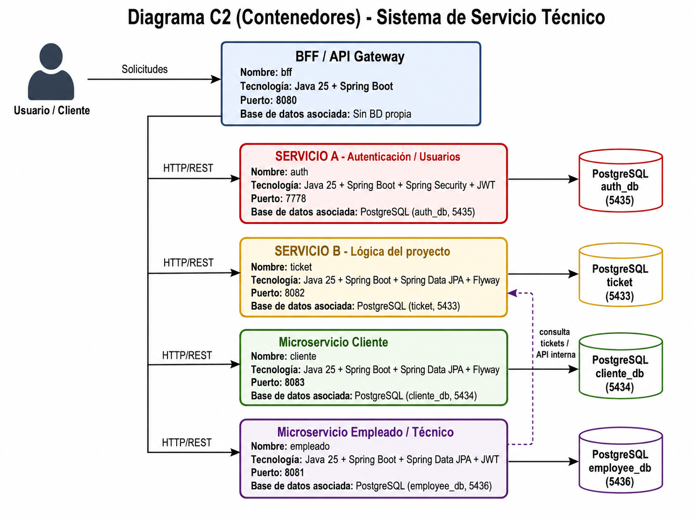
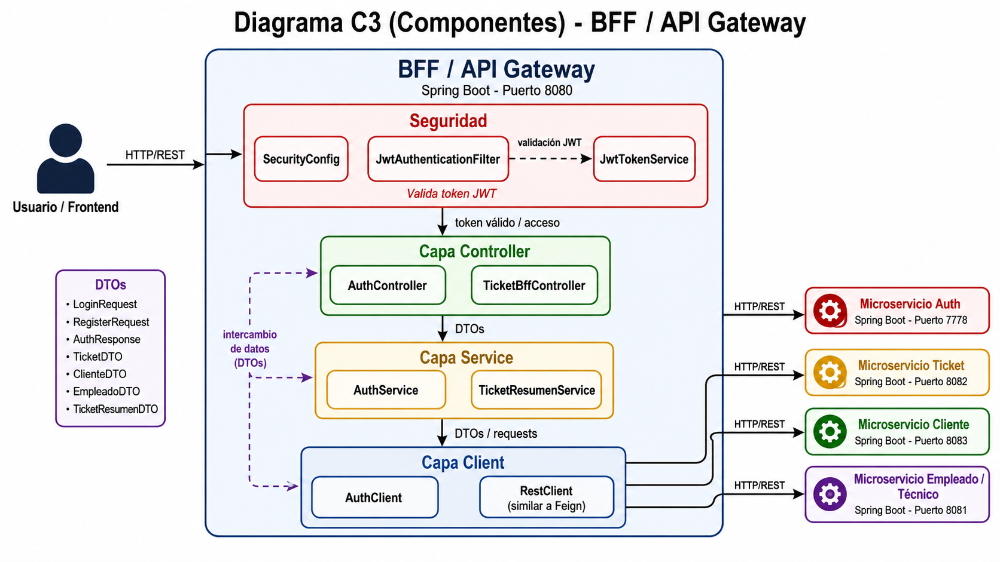

# Servicio Técnico

Sistema de servicio técnico desarrollado con **Java y Spring Boot**, organizado en una arquitectura de **microservicios**. El proyecto permite manejar clientes, empleados/técnicos y tickets de atención, además de incluir autenticación con JWT y un servicio BFF que une información de distintos módulos.

La idea principal del sistema es simular el funcionamiento de una plataforma donde un servicio técnico pueda registrar solicitudes, asignarlas a empleados y consultar la información relacionada de forma más ordenada.

## Descripción del proyecto

En muchos servicios técnicos, la información se maneja de forma separada: por un lado están los clientes, por otro los técnicos y por otro las solicitudes o tickets. Esto puede generar problemas al momento de hacer seguimiento, saber quién atiende cada caso o revisar el estado de una solicitud.

Este proyecto busca solucionar ese problema mediante una aplicación dividida en microservicios. Cada módulo tiene una responsabilidad específica, lo que permite que el sistema sea más fácil de mantener, probar y mejorar con el tiempo.

## Arquitectura general

El sistema está separado en varios servicios independientes:

| Módulo | Responsabilidad principal |
|---|---|
| **auth** | Maneja el registro, inicio de sesión y generación de tokens JWT. |
| **bff** | Funciona como intermediario entre el frontend/cliente y los demás microservicios. |
| **cliente** | Administra la información de los clientes. |
| **empleado** | Gestiona empleados o técnicos del servicio técnico. |
| **ticket** | Permite crear, consultar, modificar, eliminar y filtrar tickets de atención. |

Cada microservicio tiene su propia configuración, su propia base de datos PostgreSQL y se ejecuta en un puerto distinto. Esto permite trabajar cada parte de forma más independiente.

## Tecnologías utilizadas

- Java 25
- Spring Boot
- Spring Web / REST
- Spring Security
- Spring Data JPA
- JWT
- PostgreSQL
- Flyway
- Gradle
- Docker y Docker Compose
- JUnit, Mockito y Jacoco para pruebas

## Puertos del sistema

| Servicio | Puerto aplicación | Base de datos |
|---|---:|---:|
| BFF | 8080 | No usa base de datos propia |
| Empleado | 8081 | 5436 |
| Ticket | 8082 | 5433 |
| Cliente | 8083 | 5434 |
| Auth | 7778 | 5435 |

## Funcionalidades principales

### Autenticación

El sistema cuenta con un módulo `auth` encargado de registrar usuarios y permitir el inicio de sesión. Cuando el usuario inicia sesión correctamente, se genera un token JWT que puede ser usado para acceder a servicios protegidos.

Endpoints principales:

```http
POST /login
POST /register

También existe autenticación dentro del microservicio empleado:

POST /api/auth/register
POST /api/auth/login
GET  /api/auth/validate
Gestión de clientes

El microservicio cliente permite administrar los datos básicos de los clientes del servicio técnico, como correo, RUT, nombre, teléfono y dirección.

Endpoints principales:

GET    /api/clientes
GET    /api/clientes/{email}
POST   /api/clientes
PUT    /api/clientes/{email}
DELETE /api/clientes/{email}
Gestión de empleados

El microservicio empleado administra la información de los técnicos o trabajadores del sistema. También se conecta con el servicio de tickets para consultar solicitudes relacionadas.

Endpoints principales:

GET /api/empleados/{id}
GET /api/empleados/tickets

El endpoint de tickets desde empleados permite usar filtros como name y status.

Gestión de tickets

El microservicio ticket es uno de los módulos principales del sistema. Permite registrar solicitudes de soporte, modificar su estado, eliminarlas y consultar la información de cada ticket.

Endpoints principales:

GET    /api/tickets
GET    /api/tickets/{id}
POST   /api/tickets
PUT    /api/tickets/{id}
DELETE /api/tickets/{id}

El listado de tickets permite filtrar por:

title
status
priority
employeeId

Esto ayuda a buscar tickets según su estado, prioridad o técnico asignado.

BFF

El módulo bff funciona como una capa intermedia. Su objetivo es simplificar la consulta de información, evitando que el cliente tenga que llamar manualmente a varios microservicios.

Endpoint principal:

GET /api/bff/tickets/resumen/{idTicket}

Este endpoint obtiene la información base del ticket y la complementa con datos del cliente y del técnico. De esta manera entrega un resumen más completo en una sola respuesta.

Bases de datos

El proyecto utiliza PostgreSQL y cada servicio trabaja con su propia base de datos:

auth_db
cliente_db
employee_db
ticket

Las tablas se crean mediante migraciones con Flyway, por lo que al iniciar los servicios se valida la estructura de la base de datos. Algunos módulos también incluyen datos iniciales para poder probar el sistema más rápido, como usuarios de prueba y tickets de ejemplo.

Cómo ejecutar el proyecto

Antes de levantar el sistema con Docker, se deben generar los archivos .jar de cada microservicio.

Desde la raíz del proyecto:

cd auth && ./gradlew bootJar && cd ..
cd bff && ./gradlew bootJar && cd ..
cd cliente && ./gradlew bootJar && cd ..
cd empleado && ./gradlew bootJar && cd ..
cd ticket && ./gradlew bootJar && cd ..

En Windows se puede usar:

gradlew.bat bootJar

Luego, desde la carpeta raíz del proyecto, se puede levantar todo con Docker Compose:

docker compose up --build

Esto inicia las bases de datos y los microservicios configurados en el archivo docker-compose.yml.

Pruebas

El proyecto incluye pruebas unitarias y de integración en varios módulos. Estas pruebas ayudan a validar controladores, servicios, DTO, repositorios, filtros de seguridad y manejo de errores.

Para ejecutar las pruebas de un microservicio:

./gradlew test

También se utiliza Jacoco en varios módulos para generar reportes de cobertura. Cuando está configurado, se puede ejecutar:

./gradlew test jacocoTestReport

Los reportes se generan dentro de la carpeta build/reports/jacoco del módulo correspondiente.

Estructura general del proyecto
serviciotecnico/
├── auth/
├── bff/
├── cliente/
├── empleado/
├── ticket/
├── docker-compose.yml
├── README.md

Cada microservicio mantiene una estructura similar:

src/main/java
├── config
├── controller
├── dto
├── entity o model
├── exception
├── repository
├── service
└── security/filter/util según el módulo
Estado actual del sistema

El sistema ya cuenta con una base funcional para trabajar con microservicios, endpoints REST, bases de datos separadas, migraciones, seguridad con JWT y pruebas automatizadas.

Como mejoras pendientes, se recomienda:

Completar y ordenar la colección de Postman con todos los endpoints.
Revisar la configuración del BFF en Docker, especialmente la variable del servicio de técnicos/empleados, para que coincida con tecnico.service.url.
Terminar de fortalecer el módulo de autenticación según los requisitos finales.
Agregar diagramas o mapas conceptuales si son solicitados para la entrega.
Conclusión

Este proyecto representa una solución inicial pero funcional para la gestión de un servicio técnico. La separación por microservicios permite que cada parte del sistema tenga una responsabilidad clara, facilitando el mantenimiento, las pruebas y futuras mejoras. Además, el uso de Docker y PostgreSQL permite levantar el entorno completo de manera más ordenada y cercana a un escenario real.
```

### Diagrama de Contenedores (C2)


### Diagrama de Componentes (C3)
